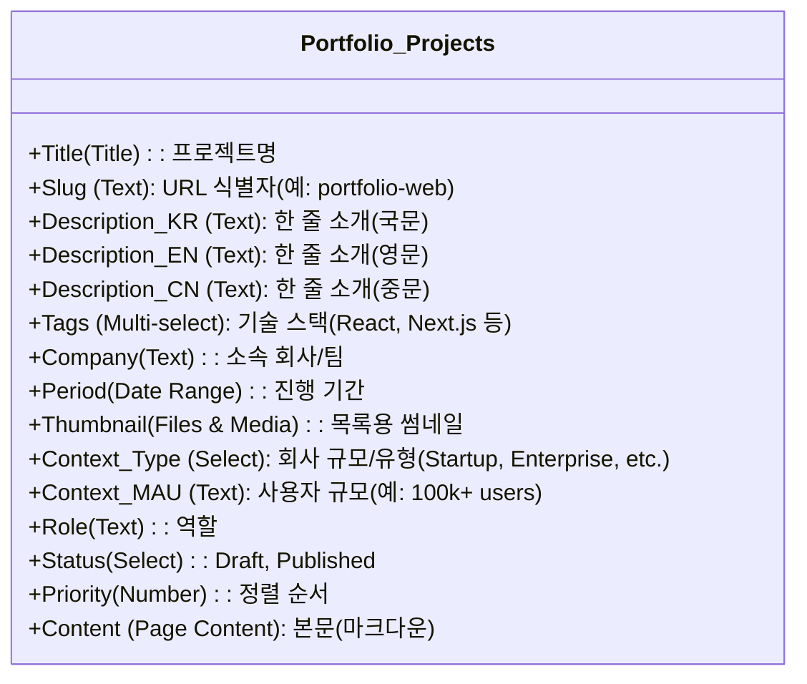
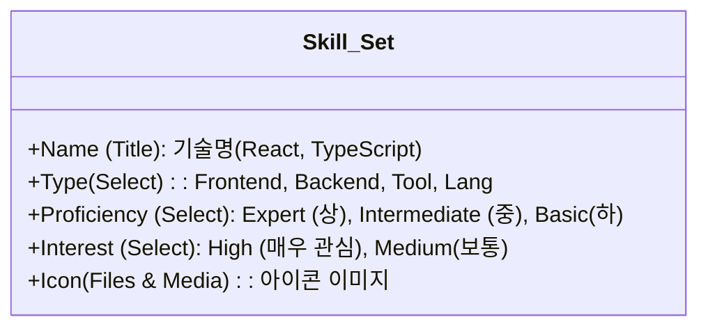

# 4. Database Design (Notion ERD)

## 0. MVP 캡슐
(1_PRD.md와 동일, 상단 참조)

## 설명
Notion을 CMS로 사용하므로 일반적인 RDBMS ERD와 달리 **Notion Database의 Property(속성)** 설계가 핵심입니다.

## 1. Notion Database Schema
### Main Database: `Portfolio_Projects`
각 행(Row)이 하나의 프로젝트 포트폴리오가 됩니다.

### Sub Database: `Skill_Set` (Optional)
스킬을 시각화하기 위한 데이터입니다. 하드코딩해도 되지만, 관리 편의를 위해 DB화 추천.

## 2. 데이터 매핑 예시 (JSON Response)
`Portfolio_Projects`의 한 페이지를 API로 가져왔을 때의 매핑 구조입니다.

| Notion Property | Frontend Component | 용도 |
|---|---|---|
| `Title` | `<h2>{title}</h2>` | 프로젝트 제목 |
| `Thumbnail` | `<Image src={url} />` | 카드 대표 이미지 |
| `Tags` | `<Badge>{tag}</Badge>` | 기술 스택 태그 |
| `Context_*` | `<ContextCard />` | **핵심 기능**: 프로젝트 맥락 전달 |
| `Content` | `<NotionRenderer />` | 상세 페이지 본문 내용 (react-notion-x 활용) |

## 3. 다국어 처리 전략
- **방식**: 하나의 DB 행(Row)에 컬럼(Property)을 언어별로 생성 (추천).
  - 예: `Description_KR`, `Description_EN`
- **본문**: 
  - 방법 A: 본문 내에서 토글이나 구분자를 사용.
  - 방법 B (심플): 상세 페이지(본문)는 **영어(Global)** 하나로 통일하고, 요약(Description/Context)만 3개 국어 지원. **MVP로는 방법 B를 강력 추천.** (본문까지 3개 국어로 관리하면 번역 피로도가 너무 높음)

> **Decision**: MVP에서는 **요약 정보(리스트 뷰)는 3개 국어**, **상세 본문은 영어(English)**를 기본(Default)으로 하되, 필요시 상단에 국문/중문 요약 블록을 배치하는 전략을 채택한다.
